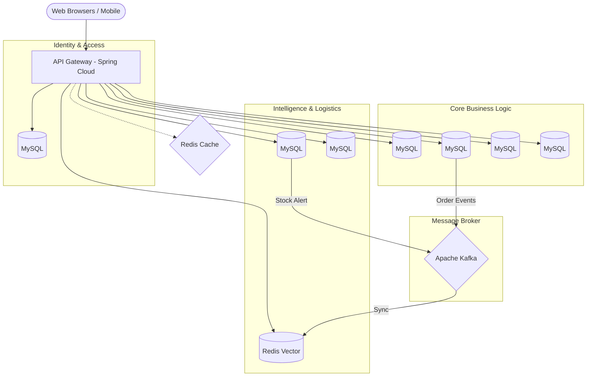

# 🚗 VoltNexus EV Enterprise Ecosystem
### Enterprise-Grade Microservices Platform for Electric Vehicle Commerce

**A high-performance, AI-driven digital ecosystem connecting EV Manufacturers (EVM) and Dealers, optimizing the entire sales lifecycle from production forecasting to customer delivery.**

[🌐 Live Demo](https://customer-app-production-b93d.up.railway.app/) · [📘 Architecture Documentation](https://dangtrong2608.atlassian.net/wiki/spaces/upwork/pages/41222538/SWR+Y+u+c+u+h+th+ng+SRS+Use+Case+Diagram) · [📽️ Video Showcase](#)

---

*(Replace this with a polished application dashboard screenshot or conceptual banner)*

## � Project at a Glance

| Metric | Value |
| :--- | :--- |
| **Microservices** | 10 high-cohesion services |
| **REST Endpoints** | 45+ Production-ready APIs |
| **DB Tables** | 30+ Normalized relational tables |
| **Messaging** | 15+ Kafka Topics for Eventing |
| **Stack** | Java 21, Spring Boot 3.4, React 18, AI |

---

## 💡 The Business Problem

Managing an EV enterprise is complex. Traditionally, there's a significant **data gap** between the manufacturer and the dealer network. This leads to:
- 📉 Inaccurate production planning due to poor visibility into regional demand.
- 📦 Suboptimal inventory allocation across dealers.
- 🐌 Slow response to market shifts and customer preferences.

**VoltNexus bridges this gap** by providing a unified, real-time platform that synchronizes data across the entire supply chain.

---

## 🔥 Engineering Highlights

Built with production-grade patterns to ensure reliability, scalability, and maintainability:

- **Event-Driven Architecture (EDA):** Leverages **Apache Kafka** for asynchronous inter-service communication, ensuring loose coupling and high system availability.
- **Transactional Outbox Pattern:** Guarantees eventual consistency between database updates and message publishing, preventing data loss during network failures.
- **Distributed Caching Strategy:** Implemented through **Redis** to minimize database load and ensure sub-100ms response times for high-traffic endpoints.
- **AI RAG Pipeline:** Uses **Spring AI** to integrate **Gemini 1.5 Flash** models with a **Redis Vector DB**, enabling context-aware demand forecasting and intelligent business insights.
- **Stateless Authentication:** Secure RBAC (Role-Based Access Control) using **JWT** and **Spring Security**, distributed seamlessly via **Spring Cloud Gateway**.

---

## 🏗️ System Architecture

---

## ✨ Core Features

### � Enterprise Security
*   **RBAC & JWT Auth:** Multi-tenant security ensuring data isolation between different dealers and headquarters.
*   **Secure Payment Flow:** Full VNPAY integration with checksum verification and server-to-server IPN handling.

### 🤖 AI-Driven Intelligence
*   **Demand Forecasting:** Technical implementation using **Gemini API** with **RAG** (Retrieval-Augmented Generation) pipeline stored in **Redis Vector DB**.
*   **Production Planning:** AI-generated recommendations based on real-time sales velocity and dealer stock levels.

### 📦 Supply Chain Control
*   **Real-time Inventory Sync:** Automatic stock adjustments via Kafka events throughout the order lifecycle.
*   **B2B Wholesale Workflow:** Specialized portal for dealers to place bulk orders from the manufacturer.

---

## �‍💻 My Role & Contribution
*Period: Dec 2025 - Present*

As the **Lead Software Architect**, my primary responsibilities included:
- **System Design:** Architects the 10-microservice ecosystem and defined the Event-Driven communication protocols.
- **AI Integration:** Implemented the `ai-service` using Spring AI to enable predictive analytics.
- **Security & Gateway:** Configured the API Gateway and implemented the stateless JWT authentication system.
- **Payment Orchestration:** Developed the robust integration with VNPAY for reliable financial transactions.

---

## 📂 Project Organization

A high-level overview of the monorepo structure:

- **[common-lib/](common-lib/)**: Shared DTOs, Event definitions, and core utilities used across all Spring Boot services.
- **[services/](services/)**: Domain-specific microservices (AI, Sales, Inventory, User, etc.).
- **[gateway/](gateway/)**: Central entry point handles routing, security, and load balancing.
- **[frontend/](frontend/)**: Contains the React applications for both Administration/Dealers and B2C Customers.
- **[config/](config/)**: Environment variable templates for seamless local and cloud deployments.
- **[sql/](sql/)**: Database schemas and lookup/seeding scripts for consistent environments.

For a detailed file-by-file breakdown, see [PROJECT_STRUCTURE.md](PROJECT_STRUCTURE.md).

---

## 🛠️ Installation & Setup

Please refer to the detailed [Setup Guide](docs/VNPAY.md#installation) in our documentation for prerequisites and step-by-step instructions using Docker Compose.

---

## 📸 Technical Showcase

### 🖥️ Enterprise Dashboard

*Insightful real-time analytics for dealer managers.*

### 🤖 AI Prediction Interface

*Visualized production planning based on predictive modeling (RAG-backed).*

---

## 📜 License

This project is licensed under the MIT License - see the [LICENSE](LICENSE) file for details.

---

  Built with ❤️ for the future of Electric Mobility.

