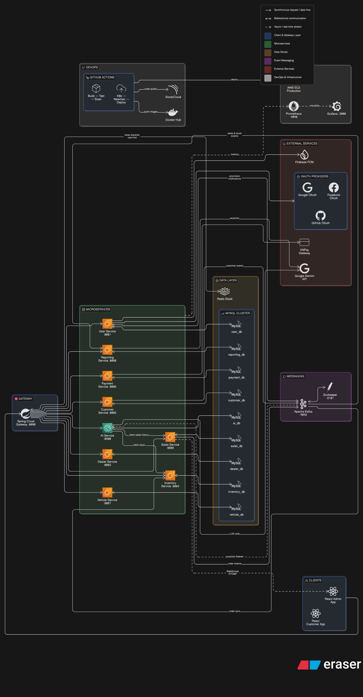

# ⚡ VoltNexus EV Enterprise Ecosystem

<p align="center">
  
  
  
  
  
  
  
</p>

---

## Problem & Solution

**Problem:** The electric vehicle industry lacks a unified, scalable enterprise platform to manage the complete lifecycle from vehicle catalog and dealership operations to customer engagement, B2B/B2C sales, payment processing, real-time notifications, and AI-driven demand forecasting.

**Solution:** VoltNexus is a **production-grade, cloud-native microservices ecosystem** built for EV manufacturers and dealership networks. It provides a fully integrated platform covering every touchpoint of the EV business — from manufacturing production planning to customer test drive appointments — all orchestrated through a modern DevOps pipeline and enhanced with generative AI capabilities.

---

## Architecture Overview

VoltNexus is built on a **10-service microservices architecture** sitting behind a reactive API Gateway with JWT-based authentication, event-driven messaging via Apache Kafka, and real-time push notifications via WebSocket (STOMP/SockJS).

[](https://app.eraser.io/workspace/LC2RNO5DsnY3C6uncXiO)

> 🔗 [View & edit full diagram on Eraser.io →](https://app.eraser.io/workspace/LC2RNO5DsnY3C6uncXiO)

---

## Technology Stack

### Backend
| Technology | Version | Purpose |
|---|---|---|
| Spring Boot | 3.5.6 | Microservice framework |
| Spring Cloud Gateway | Latest | Reactive API Gateway |
| Spring Security + JWT (jjwt) | 0.12.6 | Authentication & Authorization |
| Spring AI (Google Gemini) | 1.1.2 | LLM-powered forecasting & chatbot |
| Spring Kafka | 3.3.10 | Async event-driven messaging |
| Spring Data JPA (Hibernate) | Latest | ORM / data persistence |
| Spring Data Redis | Latest | Caching, session & token blacklist |
| Spring WebFlux | Latest | Reactive gateway & async processing |
| Spring WebSocket (STOMP) | Latest | Real-time notifications |
| MapStruct | 1.5.5 | DTO ↔ Entity mapping |
| Lombok | 1.18.40 | Boilerplate reduction |
| Bucket4j | 8.14.0 | Rate limiting |
| Firebase Admin SDK | 9.3.0 | Push notifications (FCM) |
| Dotenv Java | 3.0.0 | Environment config management |
| SpringDoc OpenAPI | 2.8.13 | API documentation (Swagger) |
| Java | 21 | Runtime (LTS) |

### Frontend
| Technology | Purpose |
|---|---|
| React 18 | Admin dashboard (`my-app`) |
| React 18 | Customer-facing app (`customer-app`) |
| WebSocket / STOMP | Real-time notification consumption |

### AI & Analytics
| Technology | Purpose |
|---|---|
| Google Gemini (via Spring AI) | Sales forecasting, chatbot, production planning |
| Apache Commons Math3 | Statistical demand modeling |
| Spring AI Vector Store | Embedding / retrieval (Assumed based on structure) |

### Infrastructure
| Technology | Purpose |
|---|---|
| Apache Kafka 7.4.0 + Zookeeper | Event streaming / async communication |
| Redis Stack | Caching, token blacklist, rate limiting state |
| MySQL | Per-service relational databases |
| Docker (multi-stage) | Containerization with common-lib caching |
| Kubernetes + Minikube | Orchestration (staging & production) |
| Prometheus + Grafana | Metrics & monitoring |
| RedisInsight | Redis management UI |

### DevOps & Quality
| Technology | Purpose |
|---|---|
| GitHub Actions | CI/CD pipeline automation |
| SonarCloud | Static code analysis & quality gates |
| Trivy (Aqua Security) | Container & filesystem vulnerability scanning |
| JaCoCo | Java code coverage reporting |
| Newman (Postman CLI) | API integration testing |
| Jira API | Automated bug creation on failure |
| Docker Hub | Container image registry |
| AWS EC2 | Production server |
| GitHub Pages | Test report publishing |

---

## Microservices Breakdown

| Service | Port | Database | Responsibilities |
|---|---|---|---|
| **Gateway** | 8080 | Redis | JWT validation, routing, rate limiting, CORS |
| **User Service** | 8081 | MySQL (user_db) | Auth (JWT + OAuth2), user management, FCM tokens |
| **Customer Service** | 8082 | MySQL (customer_db) | Customer profiles, test drives, complaints, cart, charging stations |
| **Dealer Service** | 8083 | MySQL (dealer_db) | Dealer CRUD, locations, targets, performance, contracts |
| **Inventory Service** | 8084 | MySQL (inventory_db) | Stock management, allocations, transfers, reorder alerts |
| **Payment Service** | 8085 | MySQL (payment_db) | Invoices, VNPay gateway, installments, debt tracking |
| **Sales Service** | 8086 | MySQL (sales_db) | B2B/B2C orders, quotations, contracts, promotions, WebSocket |
| **Vehicle Service** | 8087 | MySQL (vehicle_db) | Vehicle models, variants, features, price history, images |
| **Reporting Service** | 8088 | MySQL (reporting_db) | Sales reports, inventory analytics, AI-powered forecasting |
| **AI Service** | 8500 (Docker) / 8089 (K8s) | MySQL (ai_db) | Gemini-powered chatbot, demand forecasting, production planning |

---

## Key Features

- **Dual Frontend**: Separate React apps for admin/dealer staff (`my-app`) and end customers (`customer-app`)
- **AI-Powered Sales Forecasting**: Google Gemini LLM analyzes real sales and inventory data to predict 30-day demand per vehicle variant
- **AI Production Planning**: Automated manufacturing plan generation and approval workflow
- **AI Chatbot**: Context-aware EV business assistant available at `/ai/chat/ask`
- **Real-Time Notifications**: WebSocket (STOMP/SockJS) push for order status changes, staff assignments, and system alerts
- **Transactional Outbox Pattern**: Guarantees at-least-once Kafka message delivery from sales-service
- **VNPay Payment Gateway**: Full B2C online payment integration with IPN/return callbacks
- **OAuth2 Social Login**: Google, Facebook, GitHub authentication
- **Firebase Push Notifications**: Mobile FCM token management
- **Role-Based Access Control**: 5 roles (ADMIN, CUSTOMER, DEALER_MANAGER, DEALER_STAFF, EVM_STAFF) with `@PreAuthorize` enforcement
- **Rate Limiting**: Bucket4j-based guest rate limiting on AI chatbot endpoints via Gateway filter
- **Token Blacklisting**: Logout invalidation via Redis
- **Comprehensive Test Coverage**: 76+ test files across all services covering BVA, unit, integration, and controller tests

---

## CI/CD Pipeline

[](https://app.eraser.io/workspace/znVIlzq56TwuQigJbgrc)

> 🔗 [View & edit full pipeline diagram on Eraser.io →](https://app.eraser.io/workspace/znVIlzq56TwuQigJbgrc)

```
Push to main
     │
     ▼
┌─────────────────────────────────────────────┐
│          Stage 1: CI & Staging               │
│                                             │
│  1. Build common-lib (Maven)                │
│  2. Unit Tests (mvn test -DskipITs)         │
│  3. Frontend Tests (npm test)               │
│  4. SonarCloud Quality Gate                 │
│     └─ Jira Bug created on BLOCKER/CRITICAL │
│  5. Trivy Security Scan (FS)                │
│  6. Bootstrap Minikube                      │
│  7. Docker Build (all 10 services)          │
│  8. Docker Push → Docker Hub                │
│  9. K8s Deploy (Staging via Minikube)       │
│ 10. Newman API Tests → GitHub Pages Report  │
│     └─ Jira Bug created on API failure      │
└──────────────────┬──────────────────────────┘
                   │ (on success)
                   ▼
┌─────────────────────────────────────────────┐
│       Stage 2: Production Deployment         │
│                                             │
│  1. Manual Approval Gate (GitHub Env)       │
│  2. SSH into AWS EC2                        │
│  3. docker compose pull + up -d             │
│  4. docker image prune                      │
│  5. Prometheus/Grafana Health Check         │
└─────────────────────────────────────────────┘
```

---

## Deployment Strategy

### Staging (Automated)
- Runs on every push to `main` via GitHub Actions
- Deploys to **Minikube** (ephemeral Kubernetes cluster in CI runner)
- Secrets injected per-service via `kubectl create secret`
- Newman API collection validates end-to-end API contracts

### Production
- **Manual approval gate** — requires a named reviewer in the `production` GitHub Environment
- Deploys to **AWS EC2** via SSH using `appleboy/ssh-action`
- Production uses `docker compose` (not Kubernetes) for simplicity & cost
- Zero-downtime rolling: `compose down → pull → up -d → prune`

---

## Project Structure

```
VoltNexus-EV-Enterprise-Ecosystem/
├── .github/workflows/       # CI/CD pipeline (1 unified workflow)
├── common-lib/              # Shared DTO, exceptions, error codes
├── gateway/                 # Spring Cloud Gateway (reactive)
├── services/
│   ├── ai-service/          # Gemini AI: forecasting, chatbot, planning
│   ├── customer-service/    # CRM: profiles, cart, test drives, complaints
│   ├── dealer-service/      # Dealer management & contracts
│   ├── inventory-service/   # Stock, allocations, transfers
│   ├── payment-service/     # Invoices, VNPay, installments
│   ├── reporting-service/   # Analytics, reports, AI forecasting
│   ├── sales-service/       # Orders (B2B/B2C), quotations, outbox, WebSocket
│   ├── user-service/        # Auth, users, OAuth2, FCM
│   └── vehicle-service/     # Catalog, variants, features, images
├── frontend/
│   ├── my-app/              # Admin / Dealer Staff React app
│   └── customer-app/        # Public customer React app
├── k8s/
│   ├── namespace.yaml       # voltnexus namespace
│   ├── configmap.yaml       # Shared non-secret config
│   ├── infrastructure/      # Redis, Kafka, Zookeeper K8s manifests
│   └── services/            # All service Deployments + Services
├── infrastructure/
│   ├── prometheus/          # prometheus.yml scrape config
│   └── grafana/             # Provisioning + dashboards
├── docker-compose.yml       # Full local stack (dev)
├── postman/                 # Postman collections & environments
├── sql/                     # Database initialization scripts
└── pom.xml                  # Maven multi-module parent
```

---

## Setup Instructions

### Prerequisites
- Java 21, Maven 3.9+
- Docker & Docker Compose
- Node.js 18+

### Local Development

```bash
# 1. Clone repository
git clone https://github.com/phu-boop/VoltNexus-EV-Enterprise-Ecosystem.git
cd VoltNexus-EV-Enterprise-Ecosystem

# 2. Build common-lib (required first)
mvn clean install -pl common-lib -DskipTests

# 3. Configure environment files
cp config/user-service.env.example config/user-service.env
# ... edit each config/*.env with your credentials

# 4. Start full stack
docker compose up -d

# 5. Start frontend (admin)
cd frontend/my-app && npm install && npm run dev

# 6. Start frontend (customer)
cd frontend/customer-app && npm install && npm start
```

### Service Ports (Local)
| Service | URL |
|---|---|
| API Gateway | http://localhost:8080 |
| User Service | http://localhost:8081 |
| Customer Service | http://localhost:8082 |
| Dealer Service | http://localhost:8083 |
| Inventory Service | http://localhost:8084 |
| Payment Service | http://localhost:8085 |
| Sales Service | http://localhost:8086 |
| Vehicle Service | http://localhost:8087 |
| Reporting Service | http://localhost:8088 |
| AI Service | http://localhost:8500 |
| Prometheus | http://localhost:9090 |
| Grafana | http://localhost:3000 |
| RedisInsight | http://localhost:5540 |

### Running Tests

```bash
# All unit tests
mvn test -DskipITs

# Specific service
mvn test -pl services/user-service

# Frontend tests
cd frontend/my-app && npm test -- --watchAll=false
```

---

## License

See [LICENSE](LICENSE) file.